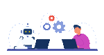

  

  

  <strong>Robotics &amp; Mechatronics @ XJTLU</strong> 
  perception → reasoning → control

## About me

I care about the complete path from a model's output to real motion: sensing the environment, reasoning under constraints, and executing commands safely on hardware.

- 🔭 **Current focus:** building reliable perception-to-action pipelines for real robots.
- 🌱 **Currently learning:** embodied AI, robust robot perception, and real-time embedded control.
- 💬 **Happy to discuss:** vision-language navigation, ROS 2 integration, STM32 control, and AI systems that act in the physical world.

> `SENSE` camera + language → `REASON` embodied AI → `GUARD` safe ROS 2 control → `ACT` STM32 + motion

## Technical stack

**Robotics** 

**AI** 

**Embedded** 

## GitHub snapshot

  <picture>
    <source
      media="(prefers-color-scheme: dark)"
      srcset="./profile/stats-dark.svg"
    />
    
  </picture>
  <picture>
    <source
      media="(prefers-color-scheme: dark)"
      srcset="./profile/top-langs-dark.svg"
    />
    
  </picture>

  Top Languages reflects the composition of public repositories, not proficiency.

---

  
    Illustration by <a href="https://lottiefiles.com/animoox">Abdul Latif</a>
    via <a href="https://lottiefiles.com/free-animation/man-and-robot-with-computers-sitting-together-in-workplace-QnbODCGAFt">LottieFiles</a> ·
    <a href="./assets/ATTRIBUTION.md">Visual credits</a>
  

